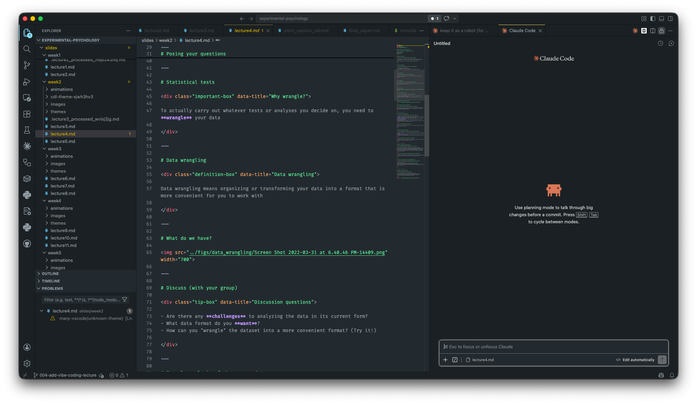
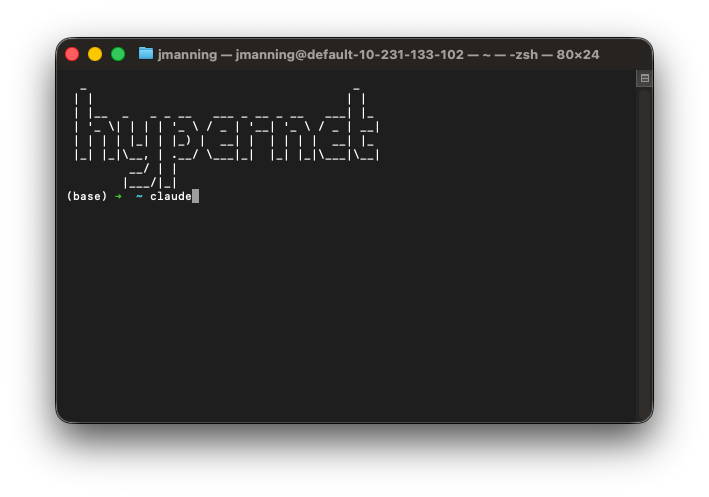
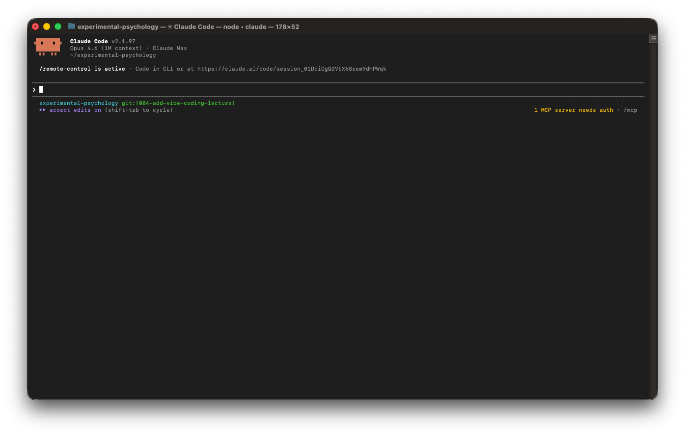

# Vibe coding: tips and tricks
### PSYC 81.09: Storytelling with Data

Jeremy R. Manning
Dartmouth College
Spring 2026

---

# Today's agenda

<div class="definition-box" data-title="What is vibe coding?">

Using AI coding agents to rapidly prototype and implement software by describing what you want in natural language, then iterating on the output.

</div>

<div class="note-box" data-title="Plan for today">

1. **The core idea** — vibe coding done well vs. done badly
2. **Tools** — free options for Dartmouth students
3. **Spec-kit workflow** — structured specifications → implementation
4. **Live demo** — let's build something delightful together (for Assignment 3!)

</div>

---
<!-- _class: scale-90 -->

# The core idea

<div class="important-box" data-title="Vibe coding is NOT making a wish">

Vibe coding means **spelling out the complete logic** of the problem — exactly like sketching a complicated program you were planning out on a whiteboard.

Then you use that sketch to guide the LLM to implement it.

</div>

<div class="warning-box" data-title="What doesn't work (especially for complex projects)">

Describing at a **very high level** what you want, and expecting the LLM to resolve the massive ambiguities in the way you were thinking. You end up with something that *kind of* works but isn't what you had in mind — and the gap widens the longer you iterate.

</div>

---
<!-- _class: scale-90 -->

# Under- vs. over-specification

<div class="warning-box" data-title="Under-specified">

> "Build me a Spotify dashboard."

The LLM guesses at your intent — you get generic, forgettable output. Worse: you don't notice the gap until you've spent an hour iterating on the wrong thing.

</div>

<div class="tip-box" data-title="Well-specified">

> "Build a single HTML page that loads my Spotify listening history. Show a stacked area chart of minutes listened per genre per month. When I hover, show the top 3 tracks from that genre that month. Color palette matches my favorite album cover. Works on mobile. No server — all processing in the browser."

Now the LLM knows what "good" looks like — and you've clarified your own thinking in the process.

</div>

---
<!-- _class: scale-80 -->

# Free coding tools (for students)

<div class="example-box" data-title="Check these out!">

- **Dartmouth Claude** ([claude.dartmouth.edu](https://claude.dartmouth.edu)): powerful coding model, free for Dartmouth students, faculty, and staff
- **Dartmouth GenAI** ([chat.dartmouth.edu](https://chat.dartmouth.edu)): free access to many models
- **GitHub Copilot** (free for students): great at code completion, chat assistance
- **Google Gemini** (free for students): long context, reasoning-heavy tasks
- **Ollama** and **LM Studio**: run LLMs locally
- **Hugging Face**: open models, useful for integrating into projects

</div>

<div class="note-box" data-title="Paid options if you want them">

**Claude Code** and **OpenAI Codex** both have paid tiers that are worth it if you code a lot. Most providers offer student discounts — check before paying full price.

</div>

---
<!-- _class: scale-80 -->

# Setting up your environment

<div class="definition-box" data-title="Two main paths">

1. **Integrated Development Environment (IDE):** full-featured, syntax highlighting, debugging, Git integration, extensions (VS Code, PyCharm, Cursor)
2. **Terminal-based coding agent:** lightweight, fast, scriptable (Claude Code, Roo Code, Codex CLI)

</div>

<div class="note-box" data-title="Also worth trying">

- Claude, OpenAI, and Roo all have native desktop apps that combine terminal agents with IDE features
- AI-first IDEs like [Cursor](https://cursor.com/) and [Antigravity](https://antigravity.google/)
- Google Colab has AI coding built in — no install needed

</div>

---
<!-- _class: scale-60 -->

# Setting up VS Code



---

# Setting up VS Code (details)

<div class="example-box" data-title="Steps">

- Download and install from [code.visualstudio.com](https://code.visualstudio.com)
- Install essential extensions:
  - GitHub Copilot
  - Jupyter
  - Python
  - Claude Code (or Roo Code)
- Activate Copilot with your GitHub account (click the Accounts icon in bottom left)

</div>

---

# Setting up Claude Code (in Terminal)

<div class="note-box" data-title="Install command">

```bash
npm install -g @anthropic-ai/claude-code
```

</div>



---
<!-- _class: scale-80 -->

# No Claude Code subscription? Use Roo Code

<div class="tip-box" data-title="Roo Code ([roocode.com](https://roocode.com/))">

An open-source alternative that works inside VS Code. Roo Code:

- Integrates with **spec-kit** (same workflow we'll use today)
- Connects to **[chat.dartmouth.edu](https://chat.dartmouth.edu)** — use your Dartmouth credentials, no subscription needed
- Supports many other providers (OpenAI, Google, Anthropic, Ollama)

</div>

<div class="example-box" data-title="Install">

1. In VS Code, open the Extensions sidebar and search for **Roo Code**
2. Install, then click the Roo icon in the activity bar
3. Configure the provider: pick "OpenAI-compatible" and point it at `https://chat.dartmouth.edu/v1`
4. Paste your Dartmouth API key (generate one in your Dartmouth Chat settings)

</div>

---
<!-- _class: scale-60 -->

# Launch Claude Code



---

# Claude Code configuration

<div class="note-box" data-title="Key things to know">

- Use `/model` to switch between models (Claude Sonnet, Opus, Haiku)
- Connect with your Anthropic account, or use GitHub Copilot models
- Runs in your terminal inside your project directory
- It can read files, write code, run commands, and browse the web

</div>

---

# Spec-kit: a framework for AI-assisted software development

<div class="definition-box" data-title="What is spec-kit?">

A "spec" is a detailed, unambiguous description of what a software project should do. Spec-kit is a workflow for using AI to go from specification to implementation in a structured way.

**This is the sketch that makes vibe coding work.**

</div>

<div class="example-box" data-title="Install it!">

```bash
# Install the spec-kit CLI globally
uv tool install specify-cli --from git+https://github.com/github/spec-kit.git

# Set up spec-kit in your project (from within your project folder)
specify init --here --ai claude
```

</div>

---
<!-- _class: scale-80 -->

# Orienting Claude Code to your project

<div class="note-box" data-title="Start here">

Clone (download) your repo and `cd` into it.

</div>

<div class="example-box" data-title="Bootstrap Claude Code">

- Launch Claude Code (run `claude` inside the project folder)
- Run `/init` to tell Claude to explore your project folder
- It maintains a `CLAUDE.md` file to help future sessions understand the project

</div>

---
<!-- _class: scale-80 -->

# The spec-kit workflow

<div class="example-box" data-title="6 steps from idea to working code">

1. **Constitution** — establish inviolable project principles
2. **Specify** — describe what you want built
3. **Clarify** — resolve ambiguities interactively
4. **Plan** — generate an architecture and design doc
5. **Tasks** — break the plan into ordered, actionable tasks
6. **Implement** — execute tasks with verification at each step

</div>

<div class="note-box" data-title="Each step produces a document">

The document from each step becomes the source of truth for the next. This is how the sketch stays grounded as the project grows.

</div>

---
<!-- _class: scale-80 -->

# Writing a good spec

<div class="warning-box" data-title="The golden rule">

Focus on **WHAT** and **WHY**, not **HOW**.

</div>

<div class="tip-box" data-title="Good specs answer four questions">

- **What** are we building? (one sentence — the elevator pitch)
- **How should it work** from the user's perspective? (the journey)
- **What are the design constraints?** (platform, accessibility, privacy, aesthetics)
- **What does "delightful" mean here?** (the thing that makes this project yours)

</div>

---
<!-- _class: scale-80 -->

# Live demo: Assignment 3 warm-up

<div class="important-box" data-title="Let's build something delightful together!">

Assignment 3 asks you to build something **delightful** — a fun game, a neat data visualization dashboard for a hobby, an interactive planetarium streaming public data, a generative art piece, a personal recommender, a quirky tool only *you* would love.

**Right now, as a class**: let's pick something and spec it out together.

</div>

<div class="example-box" data-title="Jumping-off ideas (not a prescription!)">

- Interactive visualization of your Spotify listening history with hover annotations
- "How well does your friend know you?" quiz generator from your shared texts
- Browser planetarium that pulls tonight's sky from the NASA APIs
- Generative art tied to live weather data from your hometown
- Fantasy sports "what if?" explorer (swap trades, see season outcome)

</div>

---

# Spec-kit workflow for our demo

```flow
[Constitution] --> [Specify] --> [Clarify] --> [Plan] --> [Tasks] --> [Implement:purple]
```

<div class="note-box" data-title="Documents at each step">

Each step produces a document that becomes the source of truth.

</div>

<div class="important-box" data-title="Why this matters">

Everything stays grounded in a clear, unambiguous specification. No more "the LLM went off the rails" — because the rails are written down.

</div>

---
<!-- _class: scale-80 -->

# Constitution

<div class="example-box" data-title="Prompt: /speckit.constitution">

Create a constitution for this project with these principles:
- Single HTML file (nothing to install, runs in any browser)
- All processing runs client-side (no data sent to servers)
- User delight: smooth animations, clean design, responsive feedback
- Privacy: no personally identifiable information collected or transmitted
- Works on both mobile and desktop browsers
- Accessible design (WCAG 2.1 AA)

</div>

<div class="note-box" data-title="Output">

A `constitution.md` with inviolable rules the LLM must respect in every subsequent step.

</div>

---
<!-- _class: scale-70 -->

# Specify

<div class="example-box" data-title="Prompt: /speckit.specify">

Build a *[your idea here]*. Single HTML file.

User Journey:
1. User lands on the page and sees *[opening hook]*
2. They interact with *[core mechanic]*
3. The page responds with *[delightful feedback]*
4. At the end, user can share, save, or revisit

Design goals:
- Visually engaging but not cluttered
- Feels delightful the first 10 seconds
- Works without any setup or login

</div>

<div class="note-box" data-title="Output">

A `spec.md` with user stories, acceptance criteria, and non-goals.

</div>

---
<!-- _class: scale-80 -->

# Clarify

<div class="example-box" data-title="Prompt: /speckit.clarify">

The agent will read your spec and ask things like:

1. "What should happen if the public API is down or rate-limited?"
2. "Should the animation run once or loop?"
3. "How should the user enter their hometown — city name, ZIP, geolocation?"
4. "What color palette best fits the mood — bright, muted, seasonal?"
5. "What happens on first visit vs. returning visits?"

</div>

<div class="tip-box" data-title="This is where the magic happens">

This is where vibe coding stops being a wish and becomes a plan. Answer these carefully — they're the ambiguities that would otherwise bite you during implementation.

</div>

---
<!-- _class: scale-78 -->

# Plan and tasks

<div class="example-box" data-title="Prompt: /speckit.plan">

Generate a plan for implementing the project and define success criteria for each milestone.

</div>

<div class="example-box" data-title="Prompt: /speckit.tasks">

Break the implementation plan into discrete, ordered tasks with clear acceptance criteria for each task.

</div>

<div class="tip-box" data-title="Optional: /speckit.analyze">

For complex projects, run this to identify inconsistencies, gaps, or potential issues in the spec or plan *before* you start implementing.

</div>

---
<!-- _class: scale-78 -->

# Implement

<div class="example-box" data-title="Prompt: /speckit.implement">

Launches an interactive coding session. The agent executes the plan task by task, generating code, running checks, and verifying each acceptance criterion before moving on.

</div>

<div class="note-box" data-title="Output">

Whatever each task specifies: functions, modules, tests, documentation. A task is "done" only when its acceptance criteria are met.

</div>

<div class="tip-box" data-title="Babysitting">

Claude will prompt you (often frequently) for permission to run code, execute commands, or change files. Read them carefully the first few times — then you can usually skim and click "yes" to keep things moving.

</div>

---
<!-- _class: scale-90 -->

# Guiding principles

<div class="definition-box" data-title="Simplicity">

"Simplicity is the art of maximizing the amount of work not done."

</div>

<div class="note-box" data-title="Five principles for effective vibe coding">

1. **Over-specify on purpose** — vague prompts produce vague code
2. **Start small** — get a working prototype before adding features
3. **Verify everything** — never trust AI output without checking it
4. **Iterate rapidly** — small changes, frequent testing
5. **Document as you go** — your future self (and your AI) will thank you

</div>

---

# Questions? Want to chat more?

<div class="emoji-figure">
  <div class="emoji-col">
    <span class="emoji emoji-xl emoji-bg emoji-bg-navy">&#x1F4E7;</span>
    <span class="label"><a href="mailto:jeremy@dartmouth.edu">Email</a> me</span>
  </div>
  <div class="emoji-col">
    <span class="emoji emoji-xl emoji-bg emoji-bg-purple">&#x1F4AC;</span>
    <span class="label">Join our <a href="https://stories-about-data.slack.com">Slack</a></span>
  </div>
  <div class="emoji-col">
    <span class="emoji emoji-xl emoji-bg emoji-bg-green">&#x1F481;</span>
    <span class="label">Come to <a href="https://context-lab.com/scheduler">office hours</a></span>
  </div>
</div>

<div class="note-box" data-title="Up next...">

- **Monday:** watch and get feedback on data stories about something you built with vibe coding! (Assignment 3)
- **Wednesday**: no class (I'll be out of town)
- **Thursday and Friday**: dive into a dataset as a class, from a local community group

</div>
